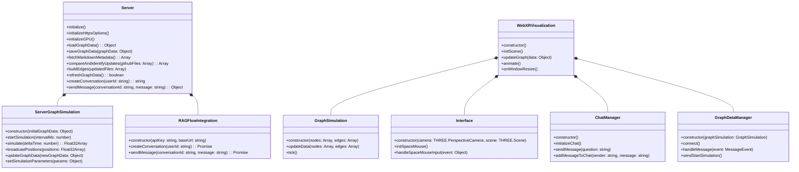
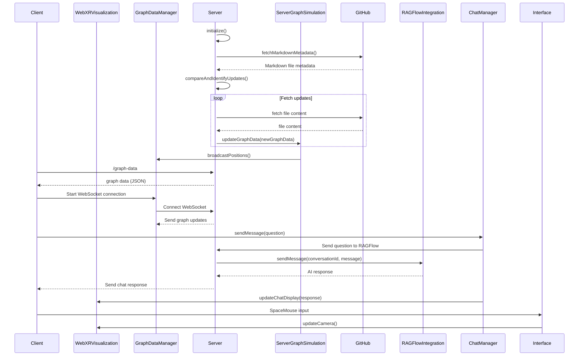

# ImmersiveLogSeq: WebXR Knowledge Graph with RAGFlow Integration

This project transforms a LogSeq-based knowledge base into an immersive 3D graph visualization, integrating real-time updates from a private GitHub repository and offering AI-powered question answering via the RAGFlow API. It is designed for exploration in WebXR-enabled environments, leveraging GPU acceleration for graph simulation and includes fallbacks for non-GPU setups.

## Overview

ImmersiveLogSeq allows users to explore their LogSeq knowledge graph in a 3D space using WebXR. It automatically processes Markdown files stored in a private GitHub repository, creates a force-directed graph, and updates it in real-time via WebSockets. The system integrates with RAGFlow, enabling users to ask questions about their knowledge base and receive AI-generated answers. The project supports immersive interactions using VR headsets and SpaceMouse devices.

### Key Features

- **3D Graph Visualization**: Explore LogSeq notes as a 3D knowledge graph.
- **WebXR Support**: Immersive experience via WebXR-enabled devices (e.g., VR headsets).
- **RAGFlow Integration**: AI-powered Q&A with conversational context.
- **Real-Time Updates**: Automatic updates from a GitHub repository via WebSockets.
- **GPU-Accelerated Graph Simulation**: Uses GPU via WebGPU for high-performance simulations, with CPU fallback.
- **HID SpaceMouse Integration**: Navigate the 3D space using a SpaceMouse.

## Architecture

The project is divided into server and client components, each responsible for specific tasks. The server handles graph data processing, WebSocket communication, and integration with external APIs, while the client manages the 3D rendering and user interaction.

### Server-Side Architecture

1. **Main Server**: Manages HTTP and WebSocket connections, GitHub updates, and RAGFlow communication.
2. **Graph Simulation**: Handles the force-directed graph algorithm, leveraging GPU acceleration.
3. **GitHub Integration**: Fetches, updates, and processes Markdown files from a GitHub repository.
4. **RAGFlow Integration**: Sends user questions to the RAGFlow API and retrieves AI-generated responses.

### Client-Side Architecture

1. **WebXR Visualization**: Renders the 3D graph using Three.js and integrates with WebXR.
2. **Graph Simulation**: Simulates the forces acting on graph nodes, either on GPU or CPU.
3. **User Interface (UI)**: Manages interactions, including the chat window and real-time data updates.
4. **SpaceMouse**: Provides HID input support for 3D navigation using a SpaceMouse.

## Diagrams

### Class Diagram



### Sequence Diagram



## Setup & Installation

### Prerequisites

- Docker
- Node.js
- GitHub Personal Access Token
- RAGFlow API Key

### Steps

1. **Clone the repository**:
   ```bash
   git clone https://github.com/yourusername/immersivelogseq.git
   cd immersivelogseq
   ```

2. **Create the `.env` file**:
   ```bash
   touch .env
   ```

   Add the following:
   ```bash
   GITHUB_ACCESS_TOKEN=your_github_token
   GITHUB_OWNER=your_github_username
   GITHUB_REPO=your_repo
   GITHUB_DIRECTORY=your_directory
   RAGFLOW_API_KEY=your_ragflow_key
   RAGFLOW_BASE_URL=https://api.ragflow.com
   ```

3. **Build & Run the Docker Container**:
   ```bash
   ./start_docker.sh
   ```

4. **Access the WebXR Graph**:
   Open your WebXR-compatible browser and go to:
   ```
   https://localhost:8443
   ```

## Development Workflow

### For Client Development

1. **Install Client Dependencies**:
   ```bash
   cd client
   npm install
   ```

2. **Run the Development Server**:
   ```bash
   npm start
   ```

### For Server Development

1. **Rust Build**:
   ```bash
   cargo build
   ```

2. **Run the Server**:
   ```bash
   cargo run
   ```

## Future Enhancements

- **Better Large Dataset Support**: Improve performance for extremely large LogSeq graphs.
- **Advanced RAGFlow AI Features**: Enable deeper integration with RAGFlow, including real-time conversation streaming.
- **Improved User Interface**: Add more intuitive controls for navigating the 3D graph.

## Contributions

Contributions are welcome. Please submit any issues or pull requests directly to the repository.

## License

This project is licensed under the Creative Commons CC0 license.